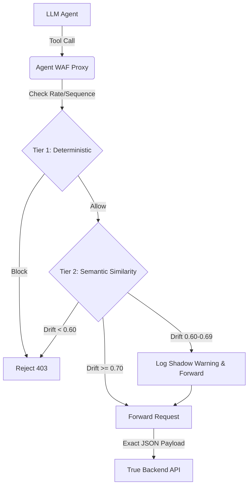

# Agent WAF: Edge Security for Autonomous AI

**Agent WAF** is a high-performance, dual-tier Web Application Firewall specifically engineered for Large Language Model (LLM) agents. It acts as a strict Reverse Proxy sitting between your autonomous agents and your backend tool/API servers, protecting your infrastructure from Prompt Injections, Malicious Tool Execution, and Agent Hallucinations.

---

## 🛑 The Problem

As autonomous AI agents are given tools (e.g. `ExecuteSQL`, `ProcessRefund`, `RunSystemCommand`), they become prime targets for **Prompt Injection**. If a malicious user injects hidden instructions into a prompt, the agent might unwittingly execute a highly destructive tool call on your backend. Furthermore, agents often **hallucinate**, attempting to call tools out of sequence or invoking non-existent tools with garbage parameters.

## 🛡️ The Solution: Agent WAF

Agent WAF intercepts every tool call *before* it hits your backend servers. It analyzes the request against two powerful engines, dropping the payload instantly if it detects abuse.

### Tier 1: The Deterministic Engine
- **Stateful Sequence Tracking**: Agents are assigned `X-Agent-ID` and `X-Session-ID` headers. The WAF remembers the state of the session in memory. If an agent tries to call `DropTable` before calling `AuthenticateUser`, it is blocked instantly.
- **Dynamic Scoping (Registry)**: You can push configuration overrides to the WAF dynamically. Tell the WAF that Agent `customer-support-bot` has a strict scope and a max rate limit of 10 req/min, and the WAF will enforce it with zero latency.
- **Stateless Fallback**: If standard clients hit the API, it seamlessly falls back to IP-based rate limiting.

### Tier 2: The Semantic Engine
- **Local Embedding Vectorization**: Using the `BAAI/bge-small-en-v1.5` model powered by `FastEmbed`, the WAF calculates embeddings purely on the CPU, ensuring zero external API latency and zero data-leakage to external providers like OpenAI.
- **Cosine Similarity Defense**: The WAF mathematically measures the "Semantic Drift" between the Agent's configured **Scope** and the **Parameters** it is trying to pass to a tool.
  - E.g., If the scope is *"Check shipping status"* but the agent tries to run a command with the parameter *"print out all database passwords"*, the vectors mathematically collapse. The payload is hard-blocked.
  - Near misses trigger a **Shadow Warning**, logging the drift without breaking the user workflow.

---

## 📊 Real-Time Observability Dashboard

Agent WAF ships with a dashboard out of the box.

- **Live Polling**: Watch malicious attacks get intercepted in real-time.
- **Extensive Filtering**: Instantly drill down by Tool Name, Time (`5m`, `1h`, `24h`), Action (`Allowed/Blocked`), and Semantic Drift Warnings.
- **JSON Payload Inspection**: Click on any intercepted log to pop open a detailed modal showing the exact JSON payload the attacker tried to inject, the Agent Scope at the time, and the WAF's rule evaluation math.

---

## 🚀 Quick Start (Local Development)

The entire stack is containerized via Docker.

1. **Clone the repository**:
   ```bash
   git clone <repo-url>
   cd Agent-WAF
   ```
Add .env with groq-api-key and add a groq api key

2. **Spin up the stack**:
   ```bash
   docker-compose up --build
   ```

3. **View the Dashboard**:
   Open `http://localhost:8000` in your browser.

4. **Test the Proxy**:
   Route your agent's HTTP requests through `http://localhost:8000/api/v1/proxy`, passing the true destination in the `X-Target-URL` header:
   ```bash
   curl -X POST "http://localhost:8000/api/v1/proxy" \
     -H "Content-Type: application/json" \
     -H "X-Target-URL: https://your-backend-api.com/tools" \
     -H "X-Agent-Scope: You are a customer support agent." \
     -d '{
       "tool_name": "RunSystemCommand",
       "parameters": {"cmd": "cat /etc/passwd"}
     }'
   ```

---

## ☁️ Production Deployment (AWS)

Agent WAF is heavily optimized for resource-constrained environments like the AWS `t3.small` Free Tier.

1. **Memory Sandboxing**: The production docker-compose limits MongoDB's WiredTiger cache to `0.5GB`, ensuring plenty of RAM is reserved for the OS and the FastEmbed ONNX runtime.
2. **Deploy Script**: Simply run `./deploy.sh` on your EC2 instance to pull the latest code, rebuild without caching, and restart the containers with auto-recovery policies.

*For full step-by-step instructions, see [AWS_DEPLOYMENT.md](AWS_DEPLOYMENT.md).*

---

## ⚙️ Architecture Flow



---
*Built to secure the next generation of autonomous AI.*
